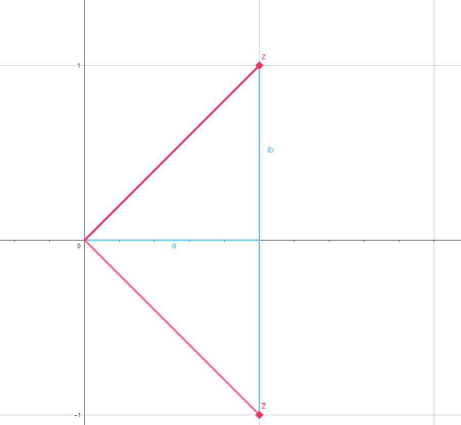

### Introduccion

Imaginemos que queremos buscar las raices de $x^2+1$ (Es decir, los x que hacen que la ecuacion valga cero). Me encontraria con la siguiente ecuacion :
$$ x^2 + 1 = 0 $$
$$x^2 = -1$$
Esto no tiene solucion real, **porque todo numero real al cuadrado es positivo**.

Pero... **No es la primera vez que un conjunto numerico no tiene solucion para una operacion**, no? Es decir
En los naturales nos pasaba (por ejemplo) que $3-5= -2$. Pero $-2 \not \in \mathbb{N}$. Esto significa que **Los naturales no son cerrados para la resta**.

Entonces armamos los numeros enteros $\mathbb{Z}$. Pero, volviamos a tener un problemas, como $\frac{3}{2} \not \in \mathbb{Z}$. **.
Los enteros no son cerrados para la division**.

... Y asi se fueron construyendo conjuntos numericos hasta llegar a $\mathbb{R}$.

Pero ahora tenemos el problema de que $x^2 = -1 \not \in \mathbb{R}$. **Los reales no son cerrados para el exponente (^).**

Para solucionarlo, decimos que $\sqrt{-1} = i$, donde $i$ es llamada **unidad imaginaria**.

Si sumamos un numero real con otro imaginario obtenemos un **numero complejo** $\mathbb{C}$.

$z = a + bi$ con $\ a,b \in \mathbb{R}$ y ademas $i \not \in \mathbb{R}$

Entonces estamos en condiciones de decir que $z \in \mathbb{C}$

y volviendo al problema anterior ($x^2 = -1$) ya tenemos solucion!
$x = i$
$$ i^2 = -1$$

⚠️ Obs: vamos a decir que $i^2 = -1$ en lugar de $i = \sqrt{-1}$. Ya que **la raiz cuadrada solo existe para los numeros reales**:
$$\sqrt{x} \ : \  \mathbb{R} \rightarrow \mathbb{R}$$

### El conjunto de los complejos

Entonces introdujimos un nuevo conjunto llamado $\mathbb{C}$, el conjunto de los números complejos. El cual cumple que $\mathbb{R} \subset \mathbb{C}$. Vamos a ver las distintas maneras de expresar un numero complejo.

### Forma binomial

Dado $z \in \mathbb{C}$ la forma $z = a+b.i$ con $a,b \in \mathbb{R}$ se llama forma binomial de $z$. $\mathbb{C} = \{ z=a+b.i; \ a,b \in \mathbb{R} \}$

### Forma trigonometrica

$$z = r.cos(\theta) + i.sen(\theta).r$$

### El plano complejo

### Notacion exponencial

$$e^{\theta i} = \cos(\theta) + i \sin(\theta) \ \forall \theta \in \mathbb{R}$$

### Teorema fundamental del algebra

"Todo polinomio de grado mayor que cero tiene una raíz.​ El dominio de la variable es el conjunto de los números complejos, que es una extensión de los números reales."

$$
\begin{matrix}
 & + & \times & - & / & \hat{} \\
\mathbb{N} \ \text{Naturals} & \mathbb{N} & \mathbb{N} & \mathbb{Z} & \mathbb{Q} & \mathbb{Q}\\
\mathbb{Z}  \ \text{Integers} & \mathbb{Z} & \mathbb{Z} & \mathbb{Z} & \mathbb{Q} & \mathbb{Q} \\
\mathbb{Q} \ \text{Rational} & \mathbb{N} & \mathbb{N} & \mathbb{Z} & \mathbb{Q} & \mathbb{Q} \\
\mathbb{R} \ \text{Real}& \mathbb{R} & \mathbb{R} & \mathbb{R} & \mathbb{R} & \mathbb{C}\\
\mathbb{C} \ \text{Complex}& \mathbb{C} & \mathbb{C} & \mathbb{C} & \mathbb{C} &
\mathbb{C} &
\end{matrix}
$$
